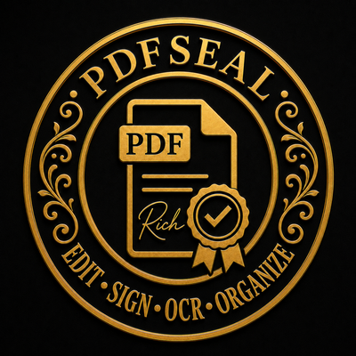

<div align="center">
  

  # PDFSeal

  **Open-source Android PDF editor — local, offline, no accounts, no ads, no tracking.**

  [Source code](https://github.com/WGRALGO/PDFSeal) · License: **AGPL-3.0-or-later**
</div>

---

## What PDFSeal is

PDFSeal is a serious, fully open-source Android PDF editor APK. It is not a thin PDF
viewer. It is built around a dedicated internal PDF engine layer (MuPDF) with a clean
separation between the engine and the UI — the UI never manipulates PDF files directly.

Everything runs **on-device**. No cloud upload, no server processing, no account,
no analytics, no ads, no trackers, no Google Play Services.

## What PDFSeal does (target feature set)

- Open local PDFs via the Android Storage Access Framework (SAF)
- View, zoom, pan, page navigation, page thumbnails
- **Add Text** — place new text boxes anywhere on a page
- **Typed Signature** — type your name, pick a signature style, place/move/resize/rotate, flatten on export
- **Cover & Replace** — visually cover a rectangular area and put replacement text on top
- **Make Editable Copy** — OCR a page, reconstruct editable text overlays, export a flattened edited copy
- Offline OCR (current page / selected pages / whole PDF where performance allows)
- Page tools — rotate, delete, reorder, merge, split (where feasible)
- Export an edited **copy** by default; the original is never silently overwritten

## Current status

> **Foundation stage (pre-v0.1.0).** The repository scaffolding, license/notice
> documents, signing setup, build configuration, and the PDF engine architecture
> are being established. See [docs/ROADMAP.md](docs/ROADMAP.md) for the phased plan
> and [docs/ARCHITECTURE.md](docs/ARCHITECTURE.md) for the engine design.

Feature status is tracked honestly. Features are not shown as done until they
actually work end-to-end (open → edit → export → reopen elsewhere).

## Honest feature definitions — please read

PDFSeal does **not** claim Acrobat-level native PDF text editing.

- **Add Text** — adds *new* text on top of the page. It does not reflow or edit the
  document's original text stream.
- **Cover & Replace** — *visual* editing only. It draws an opaque box over an area
  and lets you put new text on top. **This is NOT secure redaction.** The covered
  content may still exist underneath in the exported file's structure unless the
  page is rasterised. Do not rely on Cover & Replace to remove sensitive data.
- **Make Editable Copy** — OCR-based reconstruction. The app renders the page,
  runs offline OCR, and creates editable text boxes from recognised text. This is
  **not** true word-processor-style editing of the original PDF text.

### OCR caveat

OCR can and does make mistakes. Always review OCR output before relying on it.
PDFSeal uses **offline Tesseract OCR** (English / Latin first). No text ever
leaves the device.

## Privacy statement

PDFSeal is local and offline by design:

- No cloud upload
- No server-side processing
- No account or login
- No analytics
- No ads
- No trackers
- No Google Play Services / Google Mobile Services

## Building from source

PDFSeal is fully buildable from source. See **[docs/BUILDING.md](docs/BUILDING.md)**.

Quick version:

```bash
export JAVA_HOME=/path/to/jdk-17
./gradlew :app:assembleDebug
```

## Sideloading

1. Build (or download a signed release APK from
   [Releases](https://github.com/WGRALGO/PDFSeal/releases)).
2. Verify the SHA-256 checksum published with the release.
3. On the tablet, enable "Install unknown apps" for your file manager.
4. Open the APK and install.

Release APKs are signed with a private key that is **never** committed to this
repository. See [docs/RELEASING.md](docs/RELEASING.md).

## Third-party software

PDFSeal builds on open-source components. Full attribution and license texts are
in **[THIRD_PARTY_LICENSES.md](THIRD_PARTY_LICENSES.md)** and **[NOTICE](NOTICE)**.

Key dependencies:

| Component | Purpose | License |
|-----------|---------|---------|
| [MuPDF](https://mupdf.com/) | PDF render/edit engine | AGPL-3.0 |
| [Tesseract4Android](https://github.com/adaptech-cz/Tesseract4Android) | Offline OCR bindings | Apache-2.0 |
| [Tesseract OCR](https://github.com/tesseract-ocr/tesseract) | OCR engine | Apache-2.0 |
| AndroidX / Jetpack Compose | UI toolkit | Apache-2.0 |
| Kotlin stdlib | Language runtime | Apache-2.0 |
| Great Vibes / Caveat / Pinyon Script | Signature fonts | SIL OFL 1.1 |

Because PDFSeal links MuPDF, the entire project is distributed under the
**GNU Affero General Public License v3.0 or later**.

## License

Copyright (C) 2026 PDFSeal contributors.

This program is free software: you can redistribute it and/or modify it under the
terms of the GNU Affero General Public License as published by the Free Software
Foundation, either version 3 of the License, or (at your option) any later version.

This program is distributed WITHOUT ANY WARRANTY; without even the implied warranty
of MERCHANTABILITY or FITNESS FOR A PARTICULAR PURPOSE. See the
[GNU AGPL v3](LICENSE) for more details.

## Security

To report a vulnerability, see [SECURITY.md](SECURITY.md).
